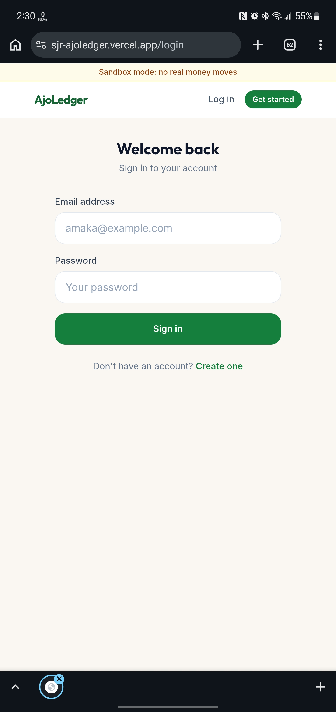
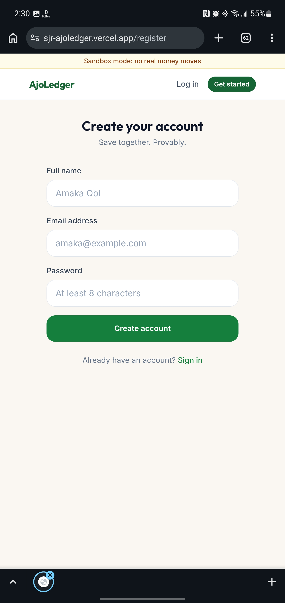
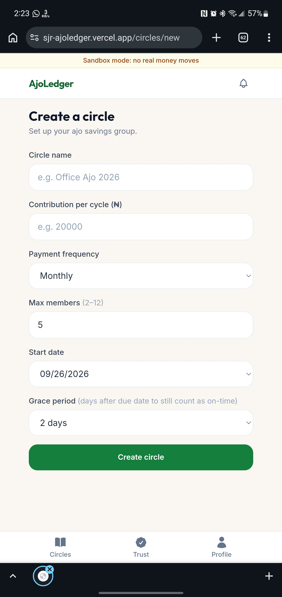
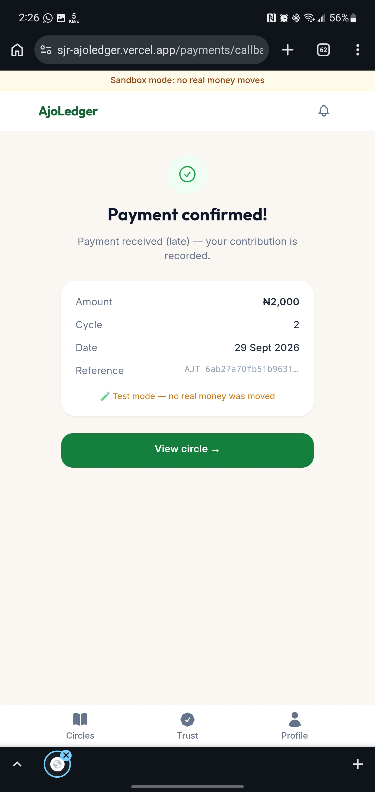
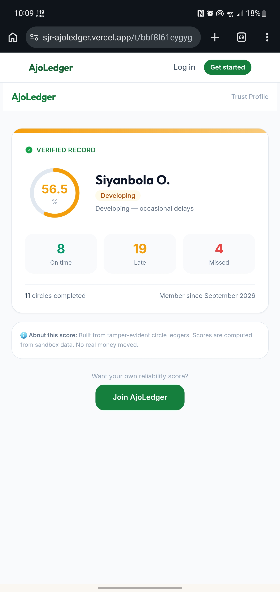
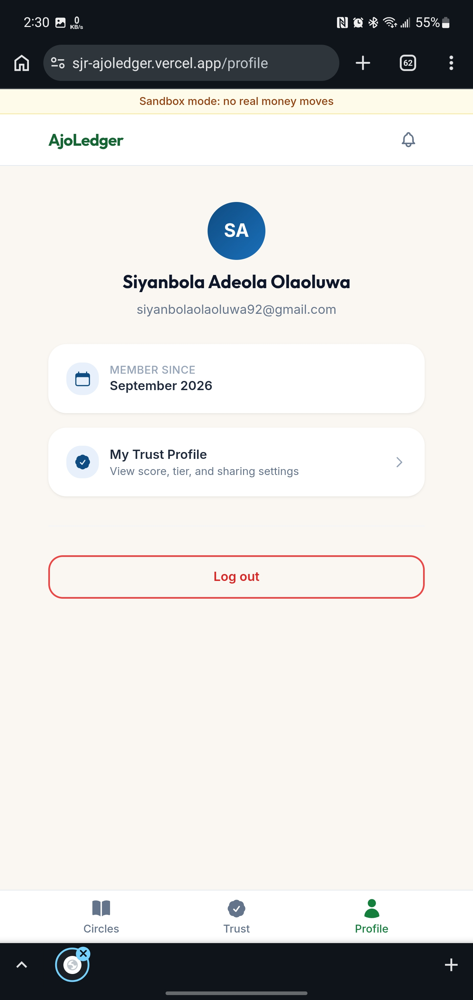

# AjoLedger Frontend

> **Save together. Provably.**

AjoLedger is a React web application for managing rotating savings circles (ajo/esusu/susu). The frontend provides account authentication, circle creation and joining, contribution/payment flows, ledger verification, public Trust Profiles, notifications, and organizer demo controls.

## Live Resources

| Resource | Link |
|---|---|
| Frontend repository | https://github.com/ShimboJr/AjoLedger-Frontend |
| Backend repository | https://github.com/ShimboJr/AjoLedger-Backend |
| Live application | https://sjr-ajoledger.vercel.app |
| Production API | https://ajoledger-backend-73kr.onrender.com |

---

## Features

### Authentication

- User registration
- User login
- Persistent JWT-based session
- Automatic authenticated API requests
- Protected routes
- Automatic redirect to login after a `401` response
- Logout

### Savings Circles

- View joined circles
- Create a new circle
- Join a circle through an invite link
- Preview an invite without authentication
- View circle members and payout order
- Organizer payout-order management
- Remove members while a circle is forming
- Start a circle
- View current cycle and obligations

### Contributions

- Start a Paystack contribution checkout
- Redirect to Paystack
- Return through the payment callback page
- Verify/settle the payment through the backend
- Display successful/failed payment state
- Refresh the callback safely because settlement is idempotent

### Ledger

- View paginated ledger entries
- Verify the ledger hash chain
- Download a circle ledger as CSV

### Reliability / Trust

- View personal Reliability Score
- View payment history counts
- Enable/disable a public Trust Profile
- Regenerate the public Trust Profile slug
- Share a public Trust Profile URL

### Notifications

- View unread count
- Read individual notifications
- Mark all notifications as read

### Demo

- Organizer-only time simulation
- Simulate passing a due date
- Simulate closing a cycle
- Demonstrate reminder and cycle-engine behavior without waiting for real dates

---

## Technology Stack

| Area | Technology |
|---|---|
| UI | React 18 |
| Build tool | Vite 5 |
| Styling | Tailwind CSS 3 |
| Routing | React Router 6 |
| HTTP client | Axios |
| Hosting | Vercel |
| Backend | Node.js / Express API |
| Database | MongoDB / MongoDB Atlas |
| Payments | Paystack |

---

## Application Architecture

```text
React App
│
├── AuthContext
│   └── JWT/session state
│
├── React Router
│   ├── Public routes
│   └── Protected routes
│
├── API Layer
│   ├── axios.js
│   ├── circles.js
│   ├── payments.js
│   ├── me.js
│   ├── notifications.js
│   └── public.js
│
└── Pages
    ├── Landing
    ├── Login / Register
    ├── Dashboard
    ├── Create Circle
    ├── Join Circle
    ├── Circle Detail
    ├── Payment Callback
    ├── Trust
    ├── Public Trust
    └── Profile
```

---

## Route Map

### Public

| Route | Purpose |
|---|---|
| `/` | Landing page |
| `/login` | Login |
| `/register` | Registration |
| `/join/:code` | Public circle invitation preview/join |
| `/t/:slug` | Public Trust Profile |

### Protected

| Route | Purpose |
|---|---|
| `/dashboard` | User's circles and trust summary |
| `/circles/new` | Create a circle |
| `/circles/:id` | Circle details, payments, ledger, organizer actions |
| `/payments/callback` | Paystack payment verification result |
| `/trust` | Personal Reliability/Trust Profile |
| `/profile` | User profile and logout |

---

## Backend API

The frontend communicates with:

```text
https://ajoledger-backend-73kr.onrender.com/api
```

For local development:

```text
http://localhost:1929/api
```

The base URL is configured with:

```env
VITE_API_URL=http://localhost:1929/api
```

---

## Authentication Flow

The frontend stores the JWT in browser `localStorage` under:

```text
ajo_token
```

The Axios request interceptor automatically attaches:

```http
Authorization: Bearer <token>
```

to authenticated API requests.

When the application starts, `AuthContext` checks for an existing token and calls:

```http
GET /api/auth/me
```

to restore the user session.

If an API request returns `401`, the Axios response interceptor removes the token and redirects the user to `/login`.

> **Note:** This implementation uses a single JWT with the backend's configured `JWT_EXPIRES_IN` value. It is not a refresh-token rotation flow.

---

## Circle Flow

```text
Landing
  │
  ▼
Register / Login
  │
  ▼
Dashboard
  │
  ├──► Create Circle
  │       │
  │       └──► Share Invite URL
  │
  └──► Join Circle
          │
          ▼
      Circle Detail
          │
          ├──► Reorder Payouts
          ├──► Start Circle
          ├──► Contribute
          └──► View Ledger
```

---

## Payment Flow

The frontend does not send a contribution amount to the payment endpoint.

### 1. Start contribution

```http
POST /api/circles/:id/contribute
```

The backend determines the amount from the user's pending obligation and returns:

```json
{
  "data": {
    "authorizationUrl": "https://checkout.paystack.com/...",
    "reference": "AJT_..."
  }
}
```

### 2. Redirect

The browser navigates to the returned Paystack `authorizationUrl`.

### 3. Paystack callback

Paystack redirects the browser to:

```text
/payments/callback
```

### 4. Verify

The callback page calls:

```http
GET /api/payments/verify/:reference
```

The backend verifies the transaction with Paystack and settles the contribution.

### 5. Display result

The callback page shows:

- Payment confirmed
- Payment not confirmed / failed
- Retry verification option

---

## API Modules

### `src/api/axios.js`

Central Axios instance.

Responsibilities:

- API base URL
- 15-second request timeout
- JSON content type
- Bearer token attachment
- Global `401` handling

### `src/api/circles.js`

Circle-related requests:

```text
create()
list()
get()
preview()
join()
reorder()
start()
removeMember()
simulate()
downloadLedgerCsv()
```

### `src/api/payments.js`

Payment and ledger requests:

```text
contribute()
verify()
getLedger()
verifyLedger()
```

### `src/api/me.js`

Trust profile:

```text
getTrust()
patchTrust()
```

### `src/api/notifications.js`

Notifications:

```text
list()
readOne()
readAll()
```

### `src/api/public.js`

Unauthenticated public Trust Profile lookup.

---

## Project Structure

```text
src/
├── App.jsx
├── main.jsx
├── api/
│   ├── axios.js
│   ├── circles.js
│   ├── me.js
│   ├── notifications.js
│   ├── payments.js
│   └── public.js
├── components/
│   ├── AppShell.jsx
│   ├── BottomNav.jsx
│   ├── LoadingSkeleton.jsx
│   ├── ProtectedRoute.jsx
│   ├── SandboxBanner.jsx
│   └── StatusChip.jsx
├── config/
│   └── brand.js
├── context/
│   └── AuthContext.jsx
├── hooks/
│   └── usePageTitle.js
├── pages/
│   ├── CircleDetail.jsx
│   ├── CreateCircle.jsx
│   ├── Dashboard.jsx
│   ├── JoinCircle.jsx
│   ├── Landing.jsx
│   ├── Login.jsx
│   ├── NotFound.jsx
│   ├── PaymentCallback.jsx
│   ├── ProfilePage.jsx
│   ├── PublicTrustPage.jsx
│   ├── Register.jsx
│   ├── TrustPage.jsx
│   └── ...
├── utils/
│   ├── dates.js
│   └── money.js
└── index.css
```

---

## Environment Variables

Create a `.env` file in the frontend project.

```env
VITE_API_URL=http://localhost:1929/api
VITE_DEMO_MODE=true
```

### Production

Use the deployed backend:

```env
VITE_API_URL=https://ajoledger-backend-73kr.onrender.com/api
VITE_DEMO_MODE=true
```

Vite exposes only variables prefixed with `VITE_` to browser code.

---

## Local Development

### Requirements

- Node.js 20+
- npm
- AjoLedger backend running locally or a reachable deployed API

### Install

```bash
git clone https://github.com/ShimboJr/AjoLedger-Frontend.git
cd AjoLedger-Frontend

npm install
```

Create `.env`:

```env
VITE_API_URL=http://localhost:1929/api
VITE_DEMO_MODE=true
```

Start the development server:

```bash
npm run dev
```

Vite serves the app on:

```text
http://localhost:5173
```

The Vite configuration also contains a development `/api` proxy targeting:

```text
http://localhost:1929
```

---

## NPM Scripts

| Command | Purpose |
|---|---|
| `npm run dev` | Start Vite development server |
| `npm run build` | Create production build |
| `npm run preview` | Preview the production build locally |

---

## Production Build

```bash
npm run build
```

The generated production assets are placed in:

```text
dist/
```

To preview them:

```bash
npm run preview
```

---

## Vercel Deployment

The frontend includes a `vercel.json` rewrite:

```json
{
  "rewrites": [
    { "source": "/(.*)", "destination": "/index.html" }
  ]
}
```

This allows React Router routes such as:

```text
/dashboard
/circles/...
/trust
/t/...
```

to work correctly when directly opened or refreshed.

Set the Vercel environment variable:

```text
VITE_API_URL=https://ajoledger-backend-73kr.onrender.com/api
```

The live application is:

```text
https://sjr-ajoledger.vercel.app
```

---

## Design and UX

The interface uses:

- Tailwind CSS
- responsive mobile-first layouts
- reusable cards and status chips
- large touch-friendly controls
- loading skeletons
- protected routes
- lazy-loaded pages
- consistent application shell/navigation
- dedicated sandbox/demo messaging

Pages are lazy-loaded with React `Suspense` so the initial application bundle can remain smaller.

---

## Screenshots

| Landing | Login |
|---|---|
|  |  |

| Register | Dashboard |
|---|---|
|  |  |

| Create Circle | Circle Detail |
|---|---|
|  |  |

| Payment Callback | Reliability / Trust Profile |
|---|---|
|  |  |

| Public Trust Profile | Ledger |
|---|---|
|  |  |

| Profile Page |
|---|
|  |

---

## Related Backend

Backend repository:

https://github.com/ShimboJr/AjoLedger-Backend

API documentation:

```text
API_DOCUMENTATION.md
```

Production API:

https://ajoledger-backend-73kr.onrender.com

---

## License

MIT
