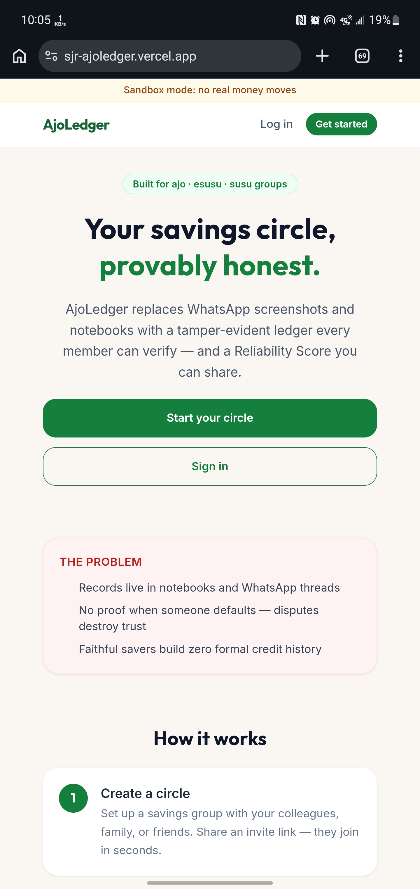
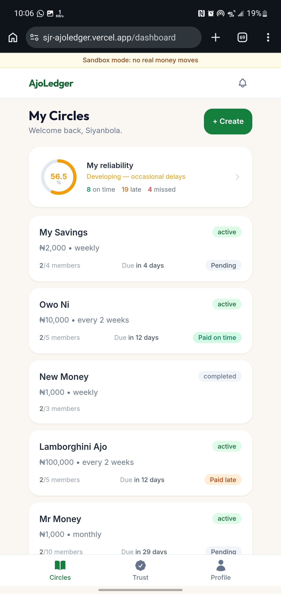
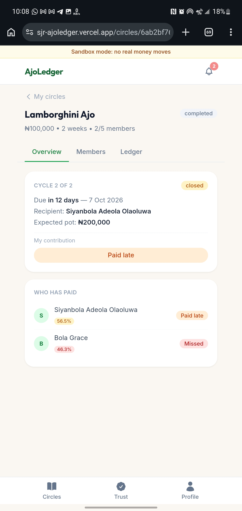
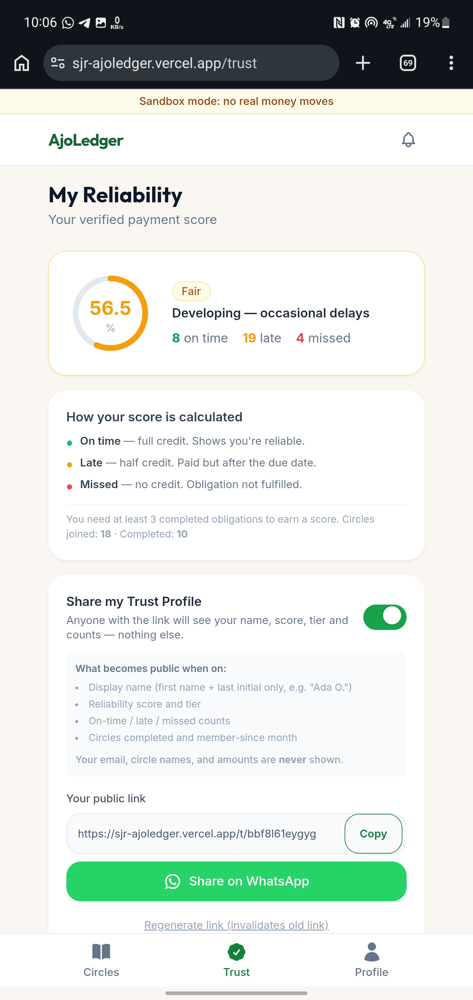
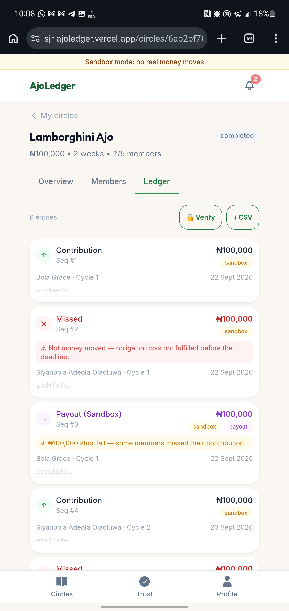

# AjoLedger — Frontend

> **Sandbox mode: no real money moves.** All payments run through Paystack **test mode**; all payouts are simulated ledger entries.

The web client for **AjoLedger** — a tamper-evident rotating savings circle (ajo / esusu / susu) platform. Save together. Provably.

🔗 **Live app:** [https://sjr-ajoledger.vercel.app/](https://sjr-ajoledger.vercel.app/)
🔗 **Backend repo:** [ShimboJr/AjoLedger-Backend](https://github.com/ShimboJr/AjoLedger-Backend)
📄 **API reference:** see the backend repo's [API_DOCUMENTATION.md](https://github.com/ShimboJr/AjoLedger-Backend/blob/main/API_DOCUMENTATION.md)

---

## Screenshots

| Landing | Dashboard |
|---|---|
|  |  |

| Circle Detail | Trust Profile |
|---|---|
|  |  |

| Ledger Tab | Public Trust Profile |
|---|---|
|  |  |

---

## What it does

AjoLedger replaces WhatsApp screenshots and notebooks with a shared, append-only ledger every circle member can verify — and a Reliability Score they can share as portable proof of saving discipline. This repo is the React client; all business logic and data live in the [backend](https://github.com/ShimboJr/AjoLedger-Backend).

## Pages / routes

| Route | Access | Purpose |
|---|---|---|
| `/` | Public | Landing page |
| `/login`, `/register` | Public | Auth |
| `/join/:code` | Public | Preview + join a circle by invite link |
| `/t/:slug` | Public | A member's shareable, read-only Trust Profile |
| `/dashboard` | Protected | List of the user's circles |
| `/circles/new` | Protected | Create a circle |
| `/circles/:id` | Protected | Circle detail — members, current cycle, contribute, ledger, CSV export, demo controls |
| `/payments/callback` | Protected | Handles the redirect back from Paystack checkout |
| `/trust` | Protected | The user's own Reliability Score + public-sharing settings |
| `/profile` | Protected | Account info and logout |

## Features

- Mobile-first UI (React 18 + Vite + Tailwind CSS)
- JWT auth with protected routes and a `?redirect=` flow (so an invite link works even if the visitor has to log in first)
- Circle creation, invite-link sharing (with a WhatsApp share button), payout reordering, and starting a circle
- Real Paystack **test-mode** checkout, with a callback page that settles the payment and shows the result
- A ledger view with status chips, a "Verify chain" button (calls the backend's tamper-detection endpoint), and a CSV download
- A Reliability Score page with a shareable, privacy-respecting public profile link
- An in-app notification bell (polls for updates, shows unread count, marks read on click)
- Demo controls (organizer-only, shown only when the backend has `DEMO_MODE` enabled) to fast-forward a circle's clock live during a demo
- A persistent "Sandbox mode: no real money moves" banner (hidden only on public Trust Profile pages, since those are shared with people outside the app)

## Tech stack

| | |
|---|---|
| Framework | React 18 + Vite 5 |
| Routing | React Router 6 (with lazy-loaded route chunks) |
| Styling | Tailwind CSS 3, mobile-first |
| HTTP | Axios |
| Hosting | Vercel |

## Getting started

### Prerequisites
- Node.js ≥ 18
- The [backend](https://github.com/ShimboJr/AjoLedger-Backend) running locally or deployed

### Setup

```bash
git clone https://github.com/ShimboJr/AjoLedger-Frontend.git
cd AjoLedger-Frontend
cp .env.example .env    # set VITE_API_URL to your backend's /api URL
npm install
npm run dev              # starts on http://localhost:5173
```

## Environment variables

| Variable | Notes |
|---|---|
| `VITE_API_URL` | Your backend's API base URL, e.g. `http://localhost:1929/api` locally, or your Render URL + `/api` in production |
| `VITE_DEMO_MODE` | `true`/`false` — shows the organizer's demo controls on a circle page. Must match the backend's `DEMO_MODE` setting, or the buttons will appear but every click will fail. |

## Available scripts

| Script | What it does |
|---|---|
| `npm run dev` | Start the Vite dev server |
| `npm run build` | Production build to `dist/` |
| `npm run preview` | Preview the production build locally |

## Project structure

```
src/
  main.jsx                Entry point
  App.jsx                  Route definitions
  components/               AppShell (top bar + notification bell), BottomNav,
                             ProtectedRoute, StatusChip, SandboxBanner, LoadingSkeleton
  context/AuthContext.jsx  Auth state, token storage, login/register/logout
  pages/                     One file per route (see table above)
  api/                       Axios instance + one module per backend resource
  utils/                     money.js (kobo↔naira formatting), dates.js (Africa/Lagos display)
  config/brand.js            App name, tagline — the only place the brand name is defined
```

## Deployment (Vercel)

1. Import this repo into Vercel.
2. Framework preset: **Vite**.
3. Set the environment variable `VITE_API_URL` to your deployed backend's `/api` URL, and `VITE_DEMO_MODE` to match the backend.
4. `vercel.json` in this repo already includes the SPA rewrite rule needed for client-side routes (e.g. `/join/:code`, `/circles/:id`) to work correctly on a hard refresh or direct link — no extra config needed.
5. After deploying, set the backend's `CLIENT_URL` environment variable to this exact Vercel URL (for CORS) and redeploy the backend.

## Design notes

Mobile-first (designed at ~360px width), calm fintech palette (deep green primary, amber for "late," red for "missed"), naira amounts always formatted with the ₦ sign and thousands separators, and status is never conveyed by color alone — every status chip carries a text label too.

## License

MIT
